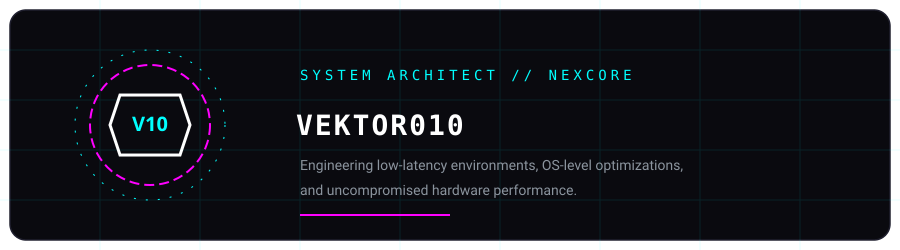
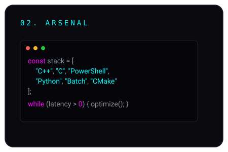
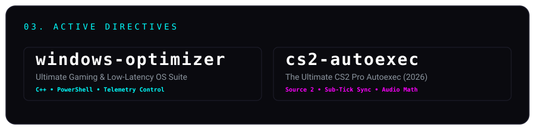

<!-- Hero Banner -->

<!-- Split Bento Boxes -->
<table border="0" cellpadding="0" cellspacing="0" style="border-collapse: collapse; border: none; background: transparent;">
  <tr style="border: none; background: transparent;">
    <td valign="top" style="border: none; background: transparent; padding: 0;">
      
    </td>
    <td valign="top" style="border: none; background: transparent; padding: 0;">
      
    </td>
  </tr>
</table>

<!-- Projects -->

  

<!-- Contact & Socials -->

&nbsp;&nbsp;

  
<i>Automated. Optimized. Open-Source.</i>

