# Vektor010

**Windows Internals | Performance Tuning | Advanced Automation | Open-Source**

 

 

---

## ▒ WHO I AM

I am a technical enthusiast specializing in low-level OS optimization, system automation, and hardware-specific tuning. My focus is on extracting maximum performance from modern systems with a strong emphasis on latency reduction, audio processing, and network reliability. 

**Focus Areas:**
- ⚙️ **OS Internals:** Deep Windows 11 optimization and telemetry control.
- ⚡ **Hardware Tuning:** AMD Ryzen 3D V-Cache architecture & NVIDIA RTX optimization.
- 🌐 **Networking:** Advanced sub-tick network tuning and routing.
- 🎧 **Audio Engineering:** Parametric EQ (PEQ) profiling and acoustic calibration.
- ⌨️ **Automation:** Scalable PowerShell and C++ tooling for environments.

---

## ▒ TECH STACK

| Languages | Systems & OS | Scripting & Build | Optimization & Audio |
|:---|:---|:---|:---|
| `C++` `C`   `Python` `HTML` | `Windows 11`   `Windows Internals` | `PowerShell`   `Batch` `CMake` `Inno Setup` | `Ryzen 3D V-Cache`   `NVIDIA GPU Tuning`   `PEQ (Parametric EQ)` |

---

## ▒ FEATURED PROJECTS

### 1. [windows-optimizer](https://github.com/Vektor010/windows-optimizer)
> **C++ / PowerShell** | *Ultimate Gaming & Low-Latency Windows 11 Optimization Suite*
> 
> A hardware-tuned environment optimizer designed for AMD Ryzen 3D V-Cache & NVIDIA GeForce RTX systems. Automates deep OS-level modifications to reduce system latency, handle background processes efficiently, and improve overall system responsiveness.

### 2. [cs2-autoexec](https://github.com/Vektor010/cs2-autoexec)
> **Source 2 Config** | *The Ultimate CS2 Pro Autoexec (2026)*
> 
> Comprehensive configuration suite for Counter-Strike 2. Focuses on FPS boosting, Sub-Tick Netcode synchronization, jumpthrow bindings, precise 12% audio math adjustments, and making the client Faceit/Premier ready out of the box.

### 3. [FiiO-JT1-PEQ-Presets](https://github.com/Vektor010/FiiO-JT1-PEQ-Presets)
> **Audio Engineering** | *Scientific PEQ Presets for FiiO / JadeAudio JT1*
> 
> Accurate, scientifically-backed parametric EQ presets to neutralize mid-bass bleeding. Includes specific profiles for general music listening and competitive CS2 audio positioning, tuned for the Topping DX1 II DAC/Amp.

### 4. [funfarm_clone](https://github.com/Vektor010/funfarm_clone)
> **Web / Automation** | *FunFarm Telegram Bot Clone*
> 
> An educational open-source project recreating the mechanics of the legendary FunFarm Telegram bot. Implements complex game logic including planting, timers, harvesting, upgrades, market economy, and faction systems.

---

## ▒ CURRENT FOCUS

- **Refining `windows-optimizer`**: Integrating further Windows 11 2026 update telemetry mitigations and scheduler adjustments.
- **Maintaining `cs2-autoexec`**: Keeping up with engine updates to guarantee optimal competitive network routing.
- **Building `funfarm_clone`**: Finalizing market mechanics and faction leaderboards.

---

## ▒ ACTIVITY & METRICS

  
  

 

## ▒ CONTACT & SOCIALS

  
  

 

  <i>Automated. Optimized. Open-Source.</i>

